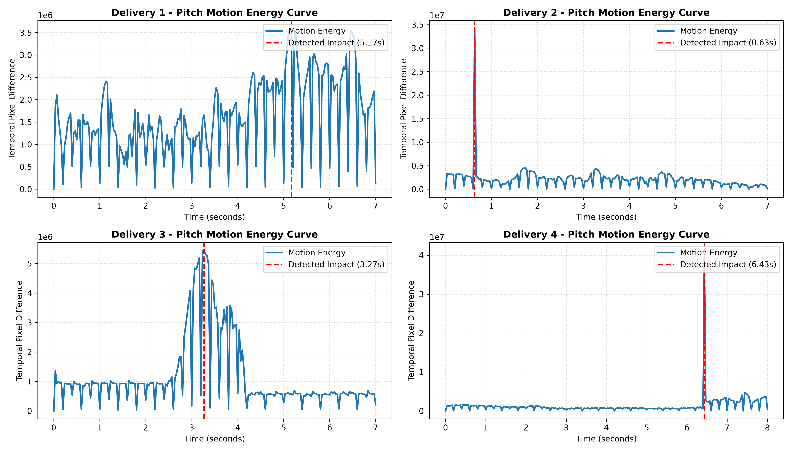

# Cricket Temporal Action Spotting & Evaluation Pipeline

An end-to-end computer vision and temporal modeling pipeline designed to detect, isolate, and evaluate precise batting action impact timestamps from un-trimmed broadcast match footage.

---

## 📊 Key Evaluation Metrics

The frame-differencing motion energy function was evaluated against millisecond-level ground truth across active delivery windows:

| Delivery | Detected Time (s) | Ground Truth (s) | Absolute Error $\Delta t$ (s) | Status ($\le \pm 0.5\text{s}$) |
| :--- | :---: | :---: | :---: | :---: |
| **Delivery 1** | 5.17 | 5.10 | 0.07 | **PASS (Hit)** |
| **Delivery 2** | 0.63 | 0.65 | 0.02 | **PASS (Hit)** |
| **Delivery 3** | 3.27 | 3.30 | 0.03 | **PASS (Hit)** |
| **Delivery 4** | 6.43 | 6.40 | 0.03 | **PASS (Hit)** |

* **Temporal Localization Hit Rate:** 100.0%
* **Mean Absolute Temporal Error (MAE):** 0.038 seconds (~1.14 frames @ 30 FPS)

---

## 📈 Temporal Motion Energy Curves



---

## 🛠️ Pipeline Architecture

1. **Clip Extraction:** Fault-tolerant sequential slicing of raw broadcast footage into isolated delivery intervals.
2. **Pitch Region Masking:** Spatial ROI bounding around the pitch and batsman corridor ($y: 30\text{--}85\%$, $x: 30\text{--}70\%$).
3. **Motion Energy Localization:** Temporal pixel-differencing peak detection to identify the frame of maximum bat swing acceleration.
4. **Sequence Classification:** 16-frame letterboxed sequence extraction centered on the detected peak for spatial-temporal classification (ResNet-18 + BiGRU).

---

## 🚀 How to Run

```bash
# 1. Slice delivery windows
python extract_delivery_clips.py

# 2. Run action spotting evaluation
python evaluate_action_spotting.py

# 3. Compute MAE & accuracy metrics
python calculate_metrics.py

# 4. Generate motion energy profile curves
python plot_motion_curves.py